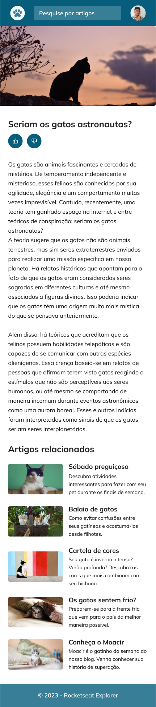
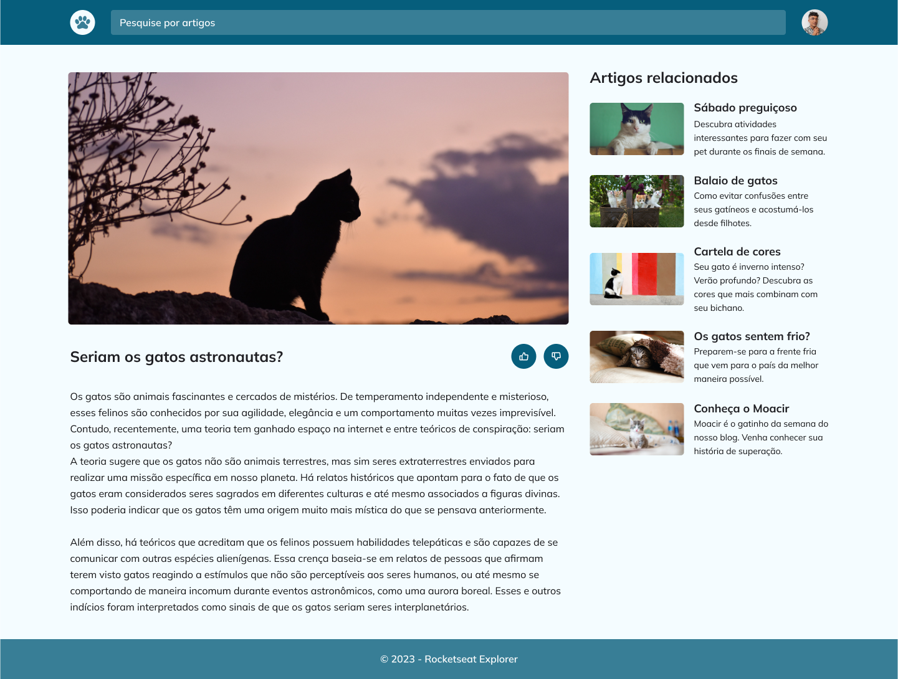

<h1 align="center"> Blog de gatos </h1>

Desafio final sobre responsividade, grid e animações.

 

 Versão mobile 

  

 Versão desktop 

  

## 🚀 Tecnologias

Esse projeto foi desenvolvido com as seguintes tecnologias:

- HTML e CSS 
- Git e GitHub

## 🔖 Layout

Você pode visualizar o layout do projeto através [DESSE LINK](https://www.figma.com/file/dKEvVp7hNVi8DiNkgLVVnP/Blog-de-Gatos-%E2%80%A2-Desafio-Explorer-(Community)?node-id=0%3A1&mode=dev). É necessário ter conta no [Figma](https://figma.com) para acessá-lo.

---

Feito com o ❤️!
